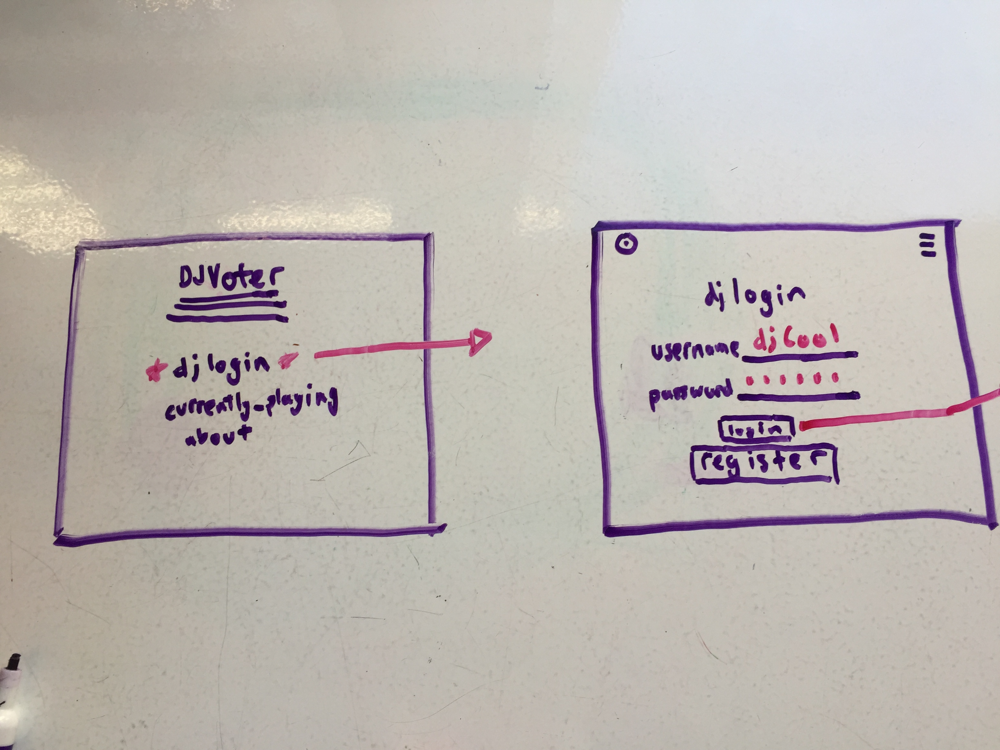
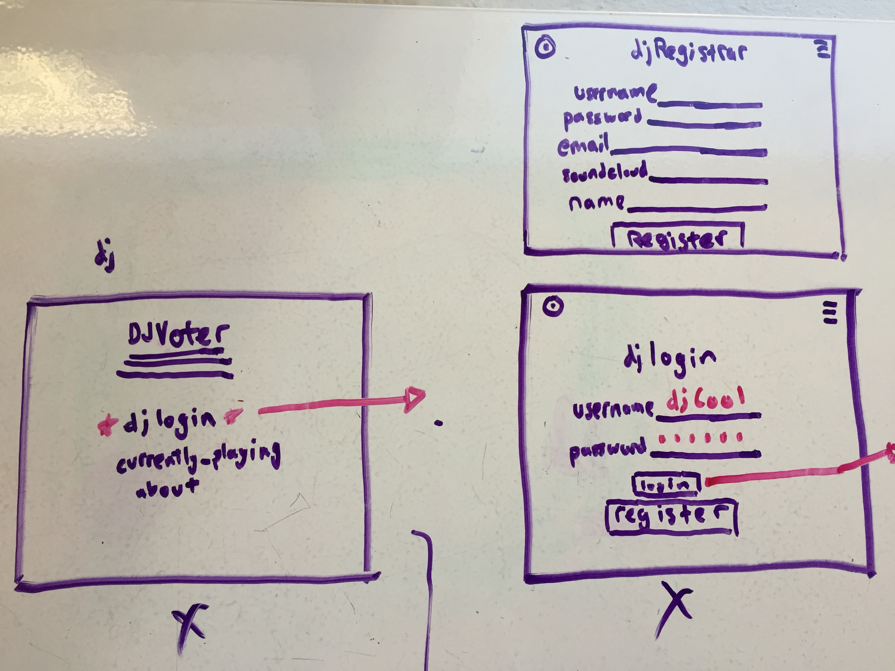
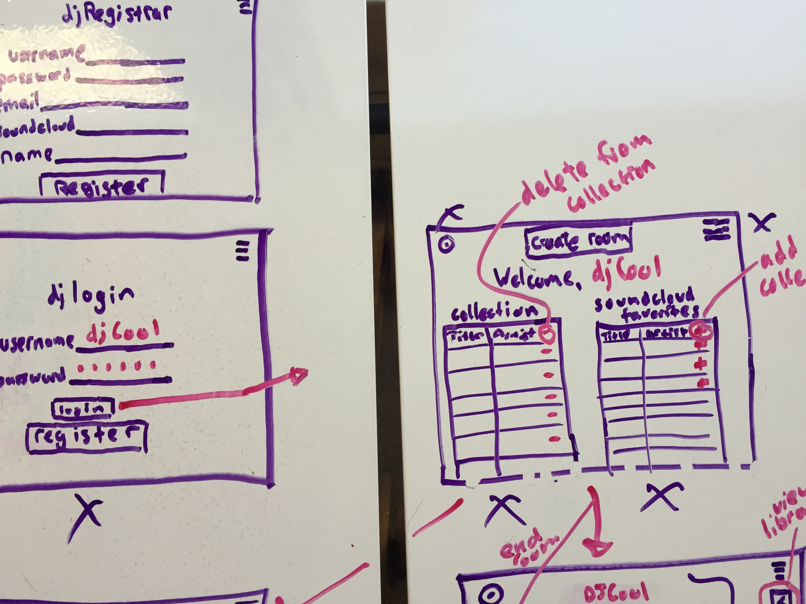
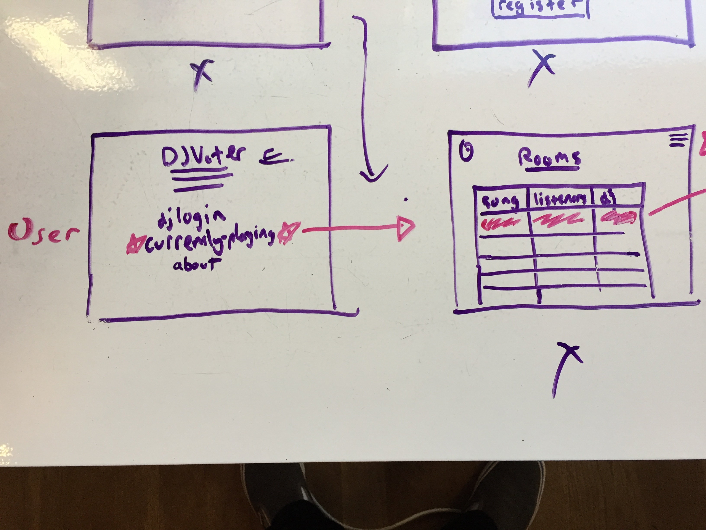
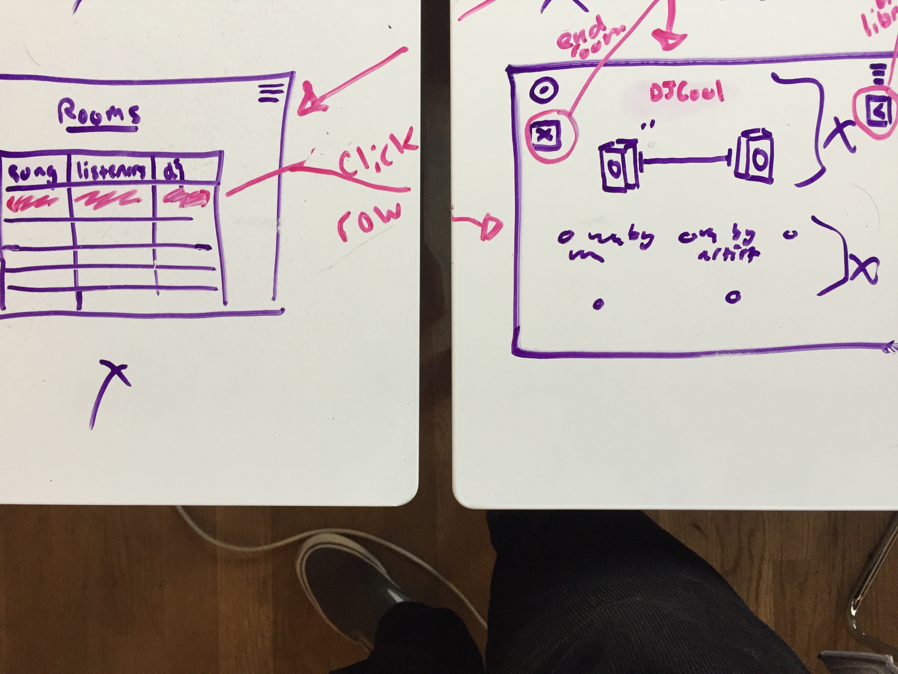

# DJVoter
DJ selects the options, the people decide the song

# User Story
Note: This is goal story. Rooms to link other users have not been implemented.

A DJ, DJ_Ceddy_Ced, wants to play his music and have listener involvement. 
He uses his favorite web app, **DJVoter**, to get in touch with his followers. 

## Login
He can login to his profile, which shows him the songs he has added to his dj_voter
collection. He can also see a list of songs from his favorited songs on his souncloud
(checkout his soundcloud https://soundcloud.com/cedric_lee). 

## Select Song
(START: TODO)

Ceddy_ced creates a room where his friends can go listen to the music he chooses for 
them. They then vote.

## Voting Process

Listeners have been waiting for Ced to come on the scene, and his song is voted as
next up! His song goes comes on and he earns lots of points. 

(END: TODO)

## Logout
He logs out because he's a super cool guy and has other stuff to do but 
the songs go on.

# Tech
- HTML / EJS
- CSS
- Node.js and Express.js
- MVC Pattern
- SQL via PG-PROMISE
- Authentication
  - passport, passport-local, bcryptjs
- TODO: Socket.io 
- soundcloud API
  - Get user favorites
  - load soundcloud widget to play song
  - todo: search for song

# Process
## Database
### users
- id
- name
- email
- password_digest
### songs
- id
- song_name // if song name exists then just add to user's songs
- artist_name
- uri: api address for song to put in src of soundcloud widget
- album_image
- genre
- todo: times_played
### users_songs
- id
- song_id
- artist_id
### TODO: db for rooms
- id of the room 
- name of the room for socket.io
- name of the creator / creator id

## Wireframes
### Menu-> djLogin

### Login>profile

### TODO: Menu-> rooms

### rooms-> player

## Views
### partials
   - boiler
   - end
   - header: 
      - HEADPHONES icon for back to home as well
      - menu button: Home / Rooms / Regist / (login / logout / profile) 
   - row from db: will fill with columns
   - header for table
   - TODO: voter radio form

### endpoint views
   - index
   - todo: rooms
      - room-index
      - room-show
   - auth:
      - login
      - register
   - user:
      - user-edit
      - user-index

## Workflow
1. ~~check setup~~
   ~~1. setup server~~
   ~~2. check soundcloud fetching and api~~
   ~~3. setup db~~
2. mvp
   1. ~~there is a song bank~~ that will stream songs into a player
   2. anyone can choose a song up to 5 songs chosen and their song
   3. users on the page can vote
   4. highest voted song plays when current song ends or someone hits the next button
3. auth
   1. ~~dj's can register and login~~ 
      1. ~~directed to a user page which shows their songs and their favoritesfrom soundcloud~~
      2. link to create a room?
      3. ~~at the user page they can edit their collection via
      songs from soundcloud -> their favorites~~ or can search or can view their
      playlists?
4. views
   1. ~~index -> djLogin which has register and sign in~~
   2. drop down of current scenes
   3. scene view
      1. listener view has header, current song and then a radio form of song to vote for
      2. needs a bunch of javascript... submit vote button
      3. something that holds all of the next_song options and their number of votes
      4. dj view
         1. their collection on the right in a scrollable box
         2. they have a click-able screen where their library pulls up from the right
         3. end room button 
   4. get player working with starter songs
   5. socket.io
      1. multiple instances of rooms. each initiated by a dj
      2. upon creation the room will be added to db
      3. dj has to end room 
      4. if dj is not present then pick a random song from 

### To-Do
1. ~~function of delete button -> deletes from users_songs~~
2. ~~play button plays songs -- oembed sc player~~
3. setup room view
   1. have a submit vote button
   2. song options
   3. player area... potentially with speakers on either side
   4. hidden song bank that can be clicked / viewed only with user
   5. upon submit vote button, show the votes underneath the player area
4. setup list of rooms view (maybe)
5. stylizing
   1. ~~header -> different for dj, has logout, user button~~
      1. ~~otherwise has home, about, rooms, login~~
      2. ~~logo in top left~~
   2. ~~color scheme -> black and red? check color picker~~
   3. ~~font picker~~
   4. pull down menu for header
   5. pull left song_bank for user
6. socket.io
   1. create a room that user can socket into
   2. dj can add 3-5 songs into the radio buttons
      1. separate out main.js into main and room
      2. have a submit vote button
   3. multiple instances of a room -> need to add db for this
7. about page
8. user can navigate their playlists as well as favorites! search soundcloud?

# Outcomes

## Takeaways
   - practice using API
   - managing req and res objects
   - implementing and using a join table
   - managing changes to database tables across all uses in the project
   - using css grid for tables
   - less color is easier to see sometimes (took out lots of red)
   - sometimes you think you don't know how to do something (join table), but if you
    try it (maybe in a testing place rather than writing directly into project), you
    may find that you can do it
   - getting through the soundcloud docs and getting the favorites and widget to load
   - even if you don't meet your end product goals for your timeline, you can still 
    feel good about getting some stuff working

## Trouble spots
   - using fetch from the main.js
      - solution: using a header for format
      - managing sending in a json object or what in body 
   - how to access user information when they are logged in
   - checking if song exists in songs table and add if doesnt; either way add to join table users_songs
      - solution: handle promises within the model

# Demo
1. navigate to heroku page
2. register a user with a valid soundcloud name (user has favorited some songs)
3. sign in
4. add some songs to collection, delete some songs => reflects playlist like creation 
of allowing duplicates
5. press play button to load soundcloud widget
6. address future
   - create rooms with socket so anyone can go to a dj's created room,
   - voting for song
   - more soundcloud gets to check various playlists and search
7. code display
   - soundcloud helpers
   - render the tables from row
      - pass in class name to give left side a class of "user[i]" and right "soundcloud[i]"
   - song model
      - create song
         - handling promise within the model
         - select first, if nothing returned from select, then create it
         - call next from router so using create as a middleware
         - then relate song to user by inserting a new row w user_id, song_id linked
   - user model
      - find users songs

  